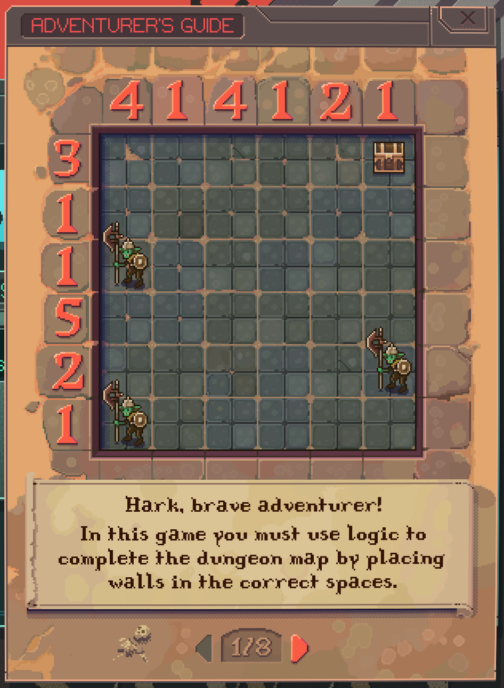

# DnD Solver

Over the weekend I downloaded a new game -- [Last Call BBS](https://www.zachtronics.com/last-call-bbs/). The game is a lot of fun -- I highly recommend it if quirky retro puzzling is your thing.

The game is made of eight... games. The one of interest today is called _Dungeons & Diagrams_.

The game is a constraint satisfaction problem, kind of like sudoku or a magic squares puzzle.

## What is this

TODO
