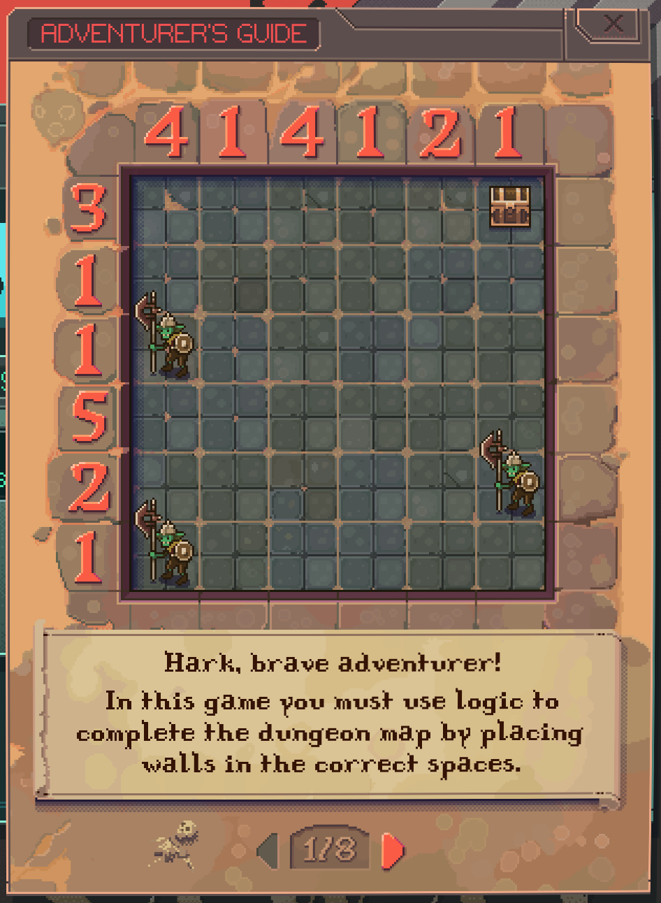
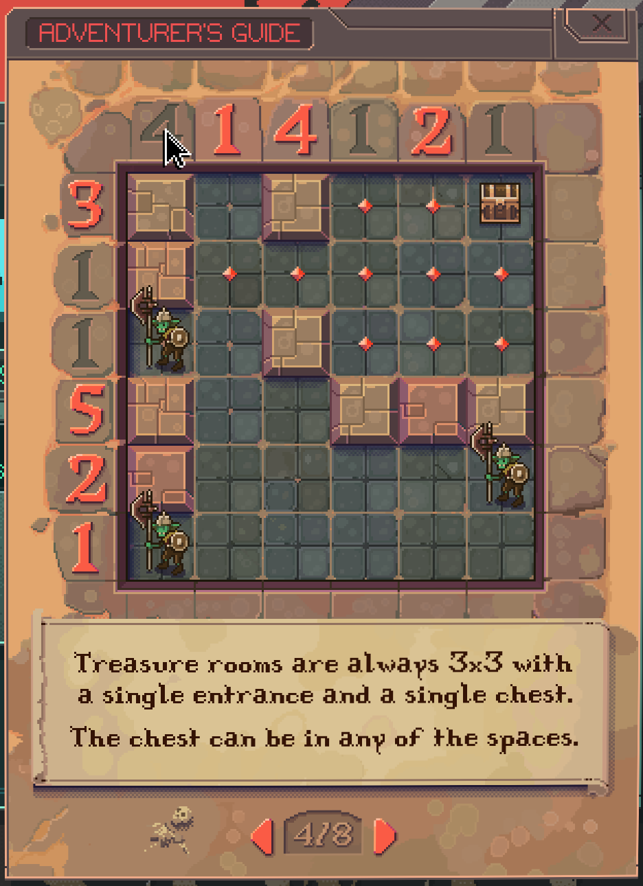
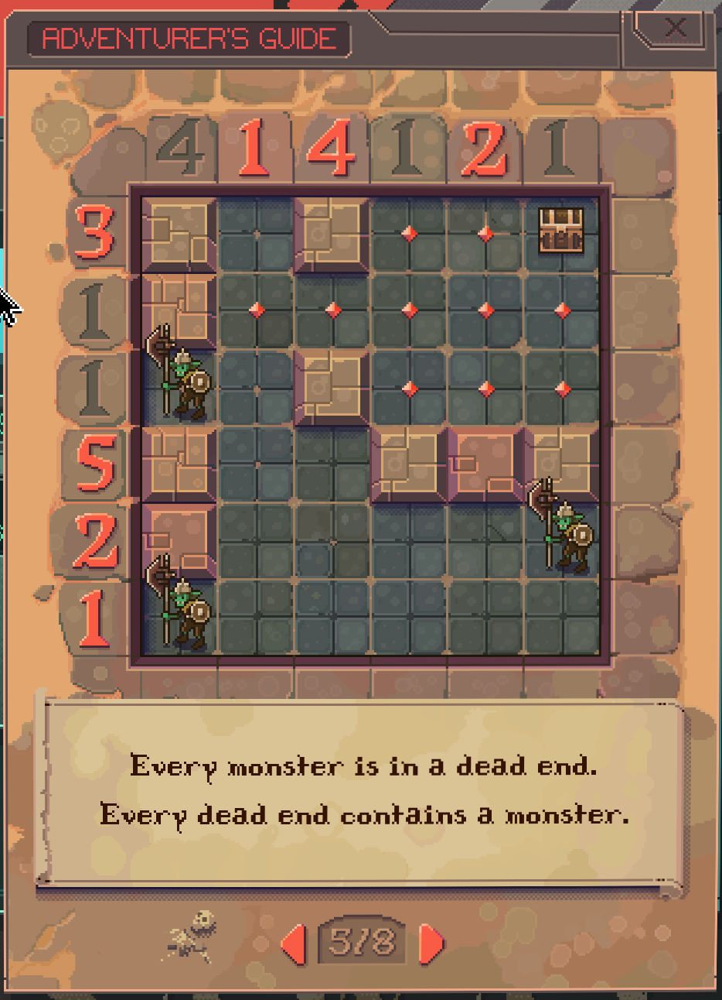
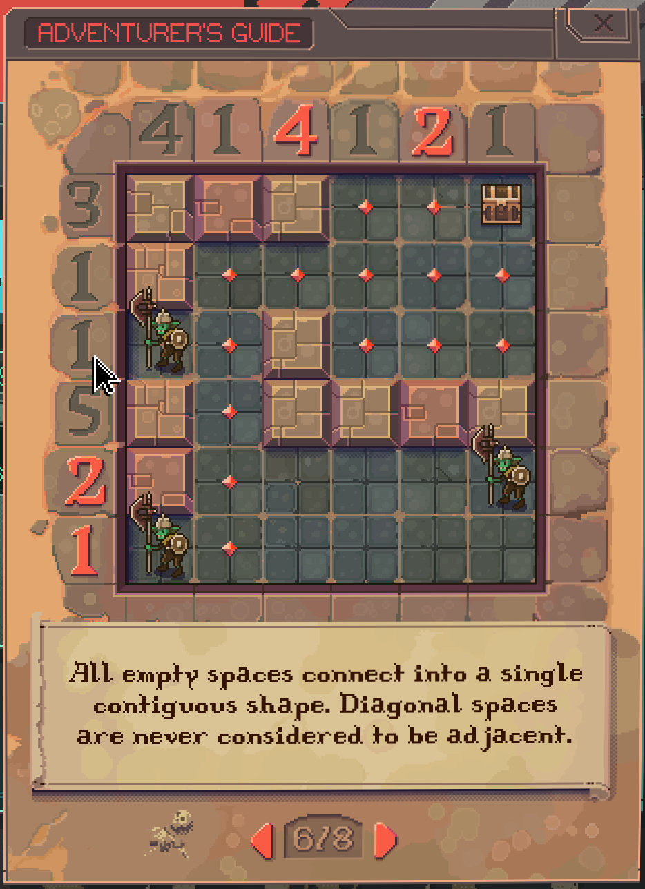
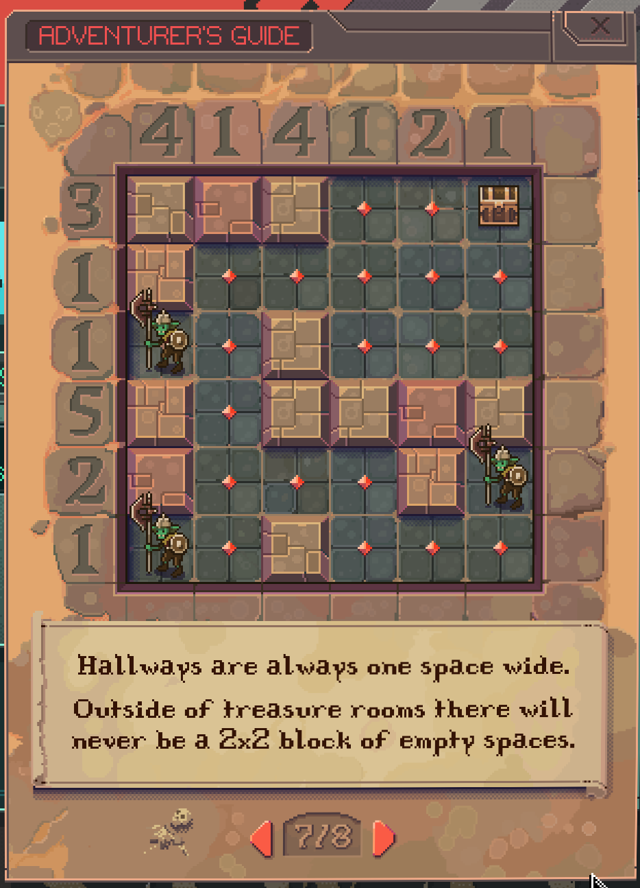
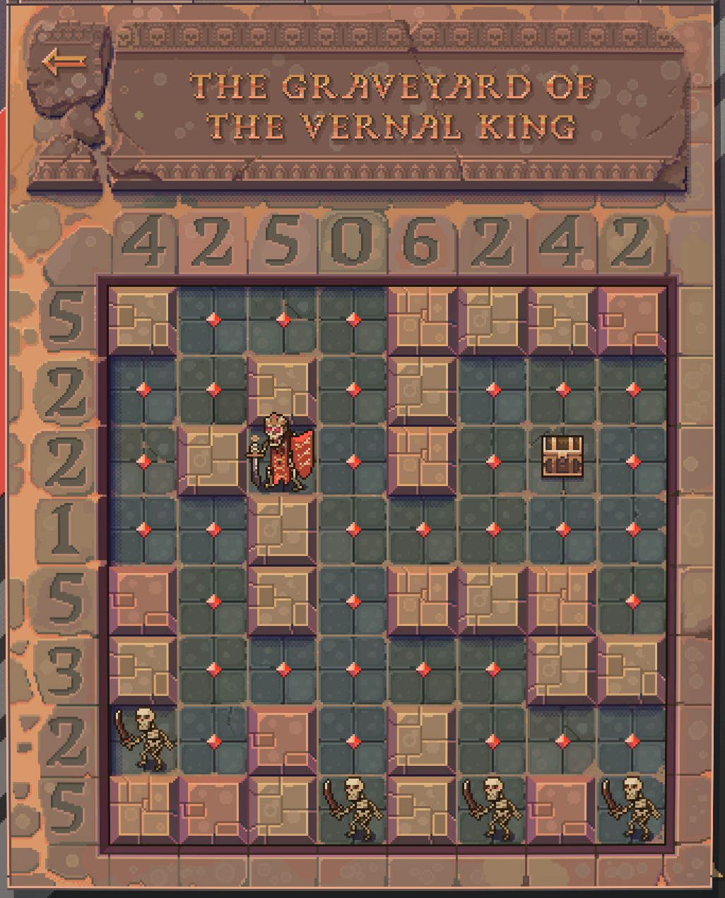

# DnD (Dungeons & Diagrams) Solver

This game is a constraint satisfaction problem, kind of like sudoku or a magic squares puzzle. Rather than explaining the rules myself, here are screenshots of the rules as presented in the game.

One difference between the screenshots above and the actual game is that the real thing is played on an 8-by-8 board (rather than 6-by-6).

